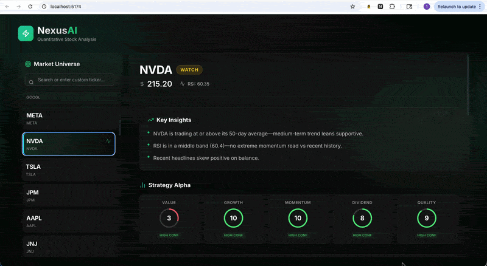

# AI Stock Analysis & Research Copilot

<p align="center">
  
</p>

Self-hosted financial research copilot with a LangGraph agent pipeline, local RAG, optional Ollama synthesis, and a React dashboard.


## Features

- FastAPI backend with versioned API routing
- **Multi-market dashboard**: US stocks, Indian NSE equities (`.NS`), global indices, forex, crypto, and commodities
- **LangGraph workflow** (`parallel_tools` → `news_grounding` → `synthesis` → `guardrail`) with agent signal + trace
- **Local RAG** (ChromaDB + sentence-transformers) over seeded SEC excerpts and ingested news
- **Optional Ollama LLM synthesis** behind `LLM_SYNTHESIS_ENABLED` with rule-based fallback
- **Redis TTL cache** (with in-memory fallback) for Yahoo analysis bundle fetches
- Stock technicals (price, 50-day SMA, RSI, optional 20-trading-day return) via Yahoo Finance for all asset classes
- Headline sentiment / keyword risk scan via Google News RSS with market-aware queries
- Fundamentals snapshot from Yahoo Finance for US and India equities
- Macro backdrop via regional volatility indices (US `^VIX`, India `^INDIAVIX`)
- Deterministic 1–10 scores for preset strategies: Value, Growth, Momentum, Dividend, Quality
- Buffett/DCF, Magic Formula, GARP, and factor frameworks (equities only)
- **Research copilot chat** (SSE stream + `/ask` endpoint) with citation chips in the UI
- Symbol search autocomplete and 6-month price chart in the UI
- **Eval harness** (`scripts/run_evals.py`) with JSON artifacts in `evals/runs/`
- Docker Compose with Redis

### Limitations

- Data is sourced from **free/public Yahoo endpoints** and RSS feeds; coverage gaps, delays, and occasional malformed quotes happen—API responses include `coverage` / `warnings` fields where relevant.
- Non-equity assets receive **technicals, news, and macro only**—equity fundamentals and strategy frameworks are intentionally skipped.
- LLM synthesis requires a running **Ollama** instance when enabled; otherwise the API falls back to deterministic rules.
- Outputs are **research assistance only**, not investment advice (see `disclaimer` on full analysis responses).

## Project Structure

```text
.
├── app
│   ├── agents
│   │   ├── base.py
│   │   ├── stock_analysis_agent.py
│   │   └── workflow.py
│   ├── api
│   │   ├── routes
│   │   │   ├── health.py
│   │   │   └── stocks.py
│   │   └── router.py
│   ├── core
│   │   └── config.py
│   ├── services
│   │   ├── stock_analysis_service.py
│   │   ├── news_analysis_service.py
│   │   ├── decision_brief_service.py
│   │   ├── fundamentals_service.py
│   │   ├── macro_instability_service.py
│   │   ├── strategy_ratings_service.py
│   │   ├── strategy_frameworks_service.py
│   │   ├── stock_universe_service.py
│   │   ├── ollama_client.py
│   │   ├── rag_service.py
│   │   └── cache_service.py
│   └── main.py
├── data/filings
├── evals/runs
├── frontend/src
├── scripts/run_evals.py
├── .env.example
├── Demo-UI.gif
├── Dockerfile
├── docker-compose.yml
├── requirements.txt
└── README.md
```

## Local Setup

### 1) Create and activate virtual environment

```bash
python3 -m venv .venv
source .venv/bin/activate
```

### 2) Install dependencies

```bash
pip install -r requirements.txt
```

### 3) Configure environment variables

```bash
cp .env.example .env
```

Update `.env` if needed.

### 4) Run the app

```bash
uvicorn app.main:app --reload
```

API will be available at:

- `http://127.0.0.1:8000`
- Swagger docs: `http://127.0.0.1:8000/docs`

## Endpoints

- `GET /api/v1/health` — health check

- `GET /api/v1/stocks/universe?market=us_stocks` — curated rows per market tab (`us_stocks`, `india_stocks`, `global_indices`, `forex`, `crypto`, `commodities`). Each row includes `name`, `ticker`, `price`, prior-session `change_pct`, `market_cap`, `volume`, `currency`, `exchange`, `asset_class`, and `market`. Delayed per Yahoo; fixed symbol sets (not live index membership).

- `GET /api/v1/stocks/analysis?ticker=AAPL` — technical snapshot only (Yahoo Finance)

Example response:

```json
{
  "ticker": "AAPL",
  "current_price": 197.12,
  "sma_50": 190.73,
  "rsi": 58.42,
  "return_20d_pct": 3.21
}
```

- `GET /api/v1/stocks/search?q=AAPL&market=us_stocks` — fuzzy symbol/company search for autocomplete

- `GET /api/v1/stocks/analyze/{ticker}` — full payload: technicals, news, regional macro, equity fundamentals/strategy scores when applicable, decision brief, and `agent_signal` (buy/hold/sell + trace). Non-equity symbols return technicals, news, and macro only.

- `POST /api/v1/stocks/ask` — grounded Q&A with citations (`ticker`, `question`).

- `GET /api/v1/stocks/chat/stream?ticker=AAPL&question=...` — SSE stream with tool trace + answer.

The full analyze response always includes a top-level `disclaimer` string. Other notable sections:

- `decision_brief` — `verdict`, `summary_bullets`, `top_risks`, `tensions`, `evidence_quality`, `synthesis_source` (`llm` | `rules`)
- `agent_signal` — `signal`, `confidence`, `notes`, `trace`
- `fundamentals` — `coverage` (`high` / `partial` / `low`), `warnings`, and normalized numeric `fields`
- `macro` — `region`, `symbol`, `vix_level`, `vix_change_5d_pct`, `volatility_regime`, `instability_score_1_10`
- `asset_class` — `us_equity`, `india_equity`, `global_index`, `forex`, `crypto`, or `commodity`
- `strategy_ratings` — entries for `value`, `growth`, `momentum`, `dividend`, and `quality`

## AI Stack (local OSS)

| Component | Default | Enable |
|-----------|---------|--------|
| LangGraph pipeline | sequential fallback | `LANGGRAPH_ENABLED=true` |
| Ollama synthesis | off | `LLM_SYNTHESIS_ENABLED=true` + Ollama running |
| RAG retrieval | on | `RAG_ENABLED=true` |
| Redis cache | in-memory fallback | `REDIS_URL=redis://localhost:6379/0` |

```bash
# Optional: start Ollama and pull a model
ollama pull llama3.2

# Run eval suite
python scripts/run_evals.py
```

## Docker

### Build and run with Docker Compose

```bash
cp .env.example .env
docker compose up --build
```

App will run at `http://127.0.0.1:8000` (API) with Redis on `6379`.

## Architecture

```text
User → FastAPI → LangGraph Workflow
                    ├─ deterministic tools (technicals, fundamentals, macro, strategies)
                    ├─ local RAG (Chroma + embeddings)
                    ├─ Ollama synthesis (optional)
                    └─ guardrails + agent_signal
```