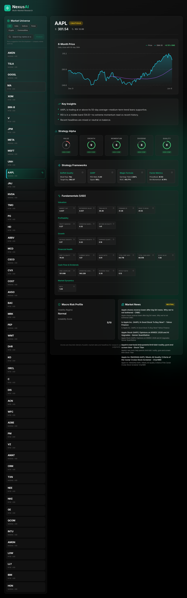

# AI Stock Analysis & Research Copilot

<p align="center">
  
</p>

Production-ready AI stock analysis platform featuring a premium dashboard and a modular, LangGraph-ready backend.


## Features

- FastAPI backend with versioned API routing
- Modular folder structure (`api`, `services`, `agents`, `core`)
- Environment-based configuration via `.env`
- Health check endpoint
- Multi-market dashboard: US stocks, Indian NSE equities (`.NS`), global indices (`^NSEI`, `^GSPC`, …), forex (`USDINR=X`), crypto (`BTC-USD`), and commodities (`GC=F`)
- Stock technicals (price, 50-day SMA, RSI, optional 20-trading-day return) via Yahoo Finance for all asset classes
- Headline sentiment / keyword risk scan via Google News RSS with market-aware queries and locales
- Fundamentals snapshot from Yahoo Finance for US and India equities (`info` plus latest reported statements when available)
- Macro backdrop via regional volatility indices (US `^VIX`, India `^INDIAVIX`): spot level, short drift, and a 1–10 “risk climate” score
- Deterministic 1–10 scores for preset strategies: Value, Growth, Momentum, Dividend, Quality (research-assistance only)
- Service and agent abstraction layer for AI workflows
- LangGraph dependency included and orchestrator scaffolded
- Docker and Docker Compose support

### Limitations

- Data is sourced from **free/public Yahoo endpoints** and RSS feeds; coverage gaps, delays, and occasional malformed quotes happen—API responses include `coverage` / `warnings` fields where relevant. Indian small-caps and some commodity contracts may have thinner Yahoo coverage.
- Non-equity assets (indices, forex, crypto, commodities) receive **technicals, news, and macro only**—equity fundamentals and Buffett/GARP strategy frameworks are intentionally skipped.
- Strategy scores and the decision brief are **rule-based heuristics**, not investment advice, forecasts, or suitability judgments (see `disclaimer` on full analysis responses).

## Project Structure

```text
.
├── app
│   ├── agents
│   │   ├── base.py
│   │   ├── stock_analysis_agent.py
│   │   └── workflow.py
│   ├── api
│   │   ├── routes
│   │   │   ├── health.py
│   │   │   └── stocks.py
│   │   └── router.py
│   ├── core
│   │   └── config.py
│   ├── services
│   │   ├── stock_analysis_service.py
│   │   ├── news_analysis_service.py
│   │   ├── decision_brief_service.py
│   │   ├── fundamentals_service.py
│   │   ├── macro_instability_service.py
│   │   ├── strategy_ratings_service.py
│   │   └── stock_universe_service.py
│   └── main.py
├── frontend
│   ├── src
│   └── ...
├── .env.example
├── Demo-UI.png
├── Dockerfile
├── docker-compose.yml
├── requirements.txt
└── README.md
```

## Local Setup

### 1) Create and activate virtual environment

```bash
python3 -m venv .venv
source .venv/bin/activate
```

### 2) Install dependencies

```bash
pip install -r requirements.txt
```

### 3) Configure environment variables

```bash
cp .env.example .env
```

Update `.env` if needed.

### 4) Run the app

```bash
uvicorn app.main:app --reload
```

API will be available at:

- `http://127.0.0.1:8000`
- Swagger docs: `http://127.0.0.1:8000/docs`

## Endpoints

- `GET /api/v1/health` — health check

- `GET /api/v1/stocks/universe?market=us_stocks` — curated rows per market tab (`us_stocks`, `india_stocks`, `global_indices`, `forex`, `crypto`, `commodities`). Each row includes `name`, `ticker`, `price`, prior-session `change_pct`, `market_cap`, `volume`, `currency`, `exchange`, `asset_class`, and `market`. Delayed per Yahoo; fixed symbol sets (not live index membership).

- `GET /api/v1/stocks/analysis?ticker=AAPL` — technical snapshot only (Yahoo Finance)

Example response:

```json
{
  "ticker": "AAPL",
  "current_price": 197.12,
  "sma_50": 190.73,
  "rsi": 58.42,
  "return_20d_pct": 3.21
}
```

- `GET /api/v1/stocks/analyze/{ticker}` — full payload: technicals, Google News RSS signals, regional macro context, and equity fundamentals/strategy scores when the symbol is a US or India stock. Non-equity symbols (e.g. `BTC-USD`, `^NSEI`, `USDINR=X`) return technicals, news, and macro only.

The full response always includes a top-level `disclaimer` string. Other notable sections:

- `fundamentals` — `coverage` (`high` / `partial` / `low`), `warnings`, and normalized numeric `fields`
- `macro` — `region`, `symbol`, `vix_level`, `vix_change_5d_pct`, `volatility_regime`, `instability_score_1_10`
- `asset_class` — `us_equity`, `india_equity`, `global_index`, `forex`, `crypto`, or `commodity`
- `strategy_ratings` — entries for `value`, `growth`, `momentum`, `dividend`, and `quality`, each with `score_1_10`, `confidence`, `drivers`, `headwinds`, and `score_label`

## Docker

### Build and run with Docker Compose

```bash
cp .env.example .env
docker compose up --build
```

App will run at `http://127.0.0.1:8000`.

## LangGraph-Ready Notes

`app/agents/workflow.py` contains the orchestration abstraction (`WorkflowOrchestrator`).
Replace the placeholder logic with a compiled LangGraph workflow and node graph execution when implementing production agent flows.


# Context
Act as a Senior Backend Software Engineer. We are extending our existing financial analysis API. Currently, the API fetches basic stock data, but we need to pivot and build a robust, multi-strategy fundamental analysis and valuation engine. 

# Objective
Create a modular Python service (using `yfinance` and `pandas`) that analyzes a given stock ticker across five distinct investment frameworks. The output should be a structured JSON response containing the analysis from each strategy, alongside an aggregated "Buy/Sell/Hold" signal.

# Task Requirements
Please implement a `FundamentalAnalysisService` class with the following asynchronous methods:

## 1. The Buffett Quality & DCF Strategy
*   **Moat Check:** Calculate the 5-year average Gross Margin. Flag as a "pass" if it's consistently >40% with low variance.
*   **Return Check:** Calculate if Return on Invested Capital (ROIC) is consistently higher than the Weighted Average Cost of Capital (WACC).
*   **Valuation:** Implement a Discounted Cash Flow (DCF) model using "Owner's Earnings" (Operating Cash Flow minus Maintenance CapEx). 
*   **Dynamic Discount Rate:** Fetch the current 10-Year Treasury Yield to use as the risk-free rate, and add a standard Equity Risk Premium (e.g., 5%) scaled by the stock's Beta.
*   **Margin of Safety:** Apply a 30% discount to the calculated intrinsic value to output a `target_buy_price`.

## 2. Magic Formula (Greenblatt)
*   Calculate **Earnings Yield** (EBIT / Enterprise Value).
*   Calculate **Return on Capital** (EBIT / (Net Working Capital + Net Fixed Assets)).
*   *Note:* Since we are evaluating a single ticker per request, output the raw percentages so our frontend can compare them against historical industry baselines.

## 3. GARP (Growth at a Reasonable Price)
*   Calculate the **PEG Ratio** (Current P/E Ratio divided by the 3-year historical EPS Growth Rate).
*   Flag as "Buy" if PEG < 1.0, and "Sell" if PEG > 2.0.

## 4. Factor Metrics (Value & Momentum)
*   **Value:** Calculate the Price-to-Book (P/B) ratio.
*   **Momentum:** Calculate the 6-month price momentum (Current Price / Price 6 months ago - 1).

## 5. Aggregated Output
*   Create a master method `analyze_ticker(ticker_symbol: str)` that runs all the above strategies concurrently using `asyncio.gather` and returns a compiled dictionary.

# Architectural & Performance Guidelines
*   **Rate Limiting & Reliability:** `yfinance` is prone to rate limits. Implement a caching strategy (e.g., using `Redis` or `functools.lru_cache` with a TTL of 24 hours) for the raw financial statement fetches.
*   **Asynchronous Execution:** Ensure I/O bound tasks (fetching income statements, balance sheets, cash flows, and treasury yields) are non-blocking.
*   **Error Handling:** If `yfinance` returns missing data for a specific metric (e.g., missing CapEx), the service should gracefully degrade that specific strategy's output to `null` rather than crashing the entire endpoint.
*   **Design Pattern:** Use the Strategy Pattern or keep the code highly modular so we can easily add or remove investment frameworks in the future.

Please generate the complete Python code for this service, including the necessary Pydantic models (or standard Dataclasses) for structuring the final JSON response.